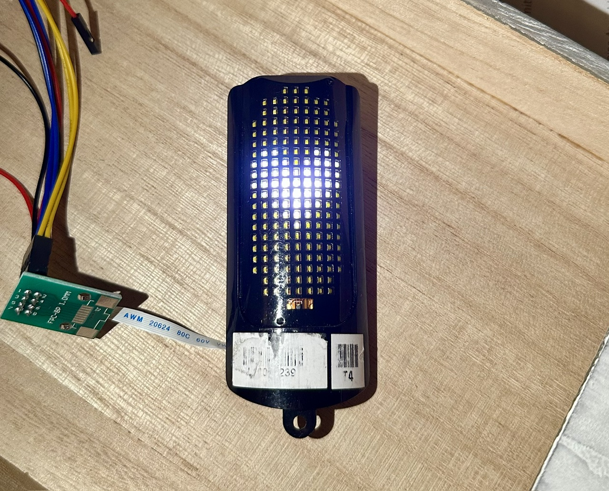

# VanMoof SX3 Display — Reuse Toolkit

Drive the 20×9 LED display salvaged from a VanMoof S3/X3 e-bike with **any
microcontroller**. Wire six pins, flash a sketch, and the panel runs your
own content — or replays all 54 original VanMoof graphics.



## Quick start

1. Salvage the display module (with its 2×5 header) from an SX3 — see
   [the guide, section 2](guide/README.md#2-the-connector-and-how-to-wire-it-up)
   for how it comes off the bike and what the daughterboard/FFC in front of
   it does.
2. Get the eight FFC conductors onto jumper-wire-friendly pins. The display's
   native connector is an 8-conductor FFC, not something you can jumper
   directly — a cheap **"FPC-8P 0.5 mm" breakout board** (FFC-in, 2×4 header
   pins out) does the job; see
   [the guide's wiring section](guide/README.md#wiring-it-to-an-esp32) for a
   photo and a note about these breakouts' inconsistent pad numbering.
3. Wire the breakout to an ESP32-C3 (or similar):

   | Signal | ESP32-C3 |
   |---|---|
   | SDA | GPIO4 |
   | SCL | GPIO3 |
   | SDB | GPIO2 |
   | 5V  | 5V (external, ≥1 A) |
   | 3V3 | 3V3 |
   | GND | GND |

   The I²C pull-ups live on the display's flex PCB, so none are needed
   externally. **5 V is mandatory** — without it the LED controllers answer
   I²C but no LED lights.

4. Open [`arduino/sx3_display_gallery`](arduino/sx3_display_gallery) in the
   Arduino IDE, enable **Tools → USB CDC On Boot → Enabled**, and flash. The
   panel cycles through all 54 original images; serial prints what's
   showing.

## What's here

| Path | Description |
|---|---|
| [`guide/README.md`](guide/README.md) | **Start here** — the full hardware + protocol write-up: wiring, the two LED controllers, framebuffer layout, the image/animation format, and a complete example sketch |
| [`editor/`](editor/README.md) | Web-based image & animation editor (open `editor/index.html`, no build/server needed) — draw, import PNG/GIF, generate text/numbers/battery gauges, browse the firmware gallery, send over BLE |
| [`arduino/sx3_display_animation`](arduino/sx3_display_animation) | Minimal standalone looping-animation sketch — no BLE, no data files, the guide's reference example |
| [`arduino/sx3_display_gallery`](arduino/sx3_display_gallery) | Rotates through all 54 original VanMoof images, with serial status |
| [`arduino/sx3_display_ble_receiver`](arduino/sx3_display_ble_receiver) | ESP32 BLE receiver — plays images/animations pushed live from the web editor |
| [`arduino/sx3_display_text_scroller`](arduino/sx3_display_text_scroller) | Scrolling-text sketch with two bitmap fonts |
| [`arduino/sx3_display_calibrate`](arduino/sx3_display_calibrate) | Raw framebuffer-offset scanner, for re-deriving the pixel mapping by hand |
| [`firmware-documents/`](firmware-documents) | Reverse-engineering provenance: firmware internals, function reference, image-format verification notes (background reading, not needed to build anything) |
| [`firmware-tools/extract_images.py`](firmware-tools/extract_images.py) | Extracts display images from a VanMoof `mainware_*.bin` you supply yourself |

## The essentials in one box

```
I²C 400 kHz · 7-bit addr LEFT 0x30 / RIGHT 0x33 / light sensor 0x10
Init per chip: C5→FE; 04→FD; 41→00; 80→01; C5→FE; 02→FD;
               [00 + 150×FF]; C5→FE; 00→FD
Push per chip: 00 + 150 PWM bytes, page stays 0x00, chunk ≤24 bytes
Map LEFT : offset = (4-col)*30 + row      (col 0..4)
Map RIGHT: offset = (9-col)*30 + row      (col 5..8)
Image pixel word = num_frames*relRow + frame + num_frames + 3   (interleaved!)
Intensity LUT = {00,04,08,10,20,40,80,FF}
```

See [the guide](guide/README.md) for what all of this means.

## Status

Verified working end-to-end on an ESP32-C3 SuperMini with a salvaged panel:
all 54 firmware images and animations render correctly, both from the
Arduino gallery sketch and via BLE from the web editor.

## License

MIT — see [LICENSE](LICENSE). Independent hobby project, not affiliated with
or endorsed by VanMoof. Use salvaged hardware at your own risk.
