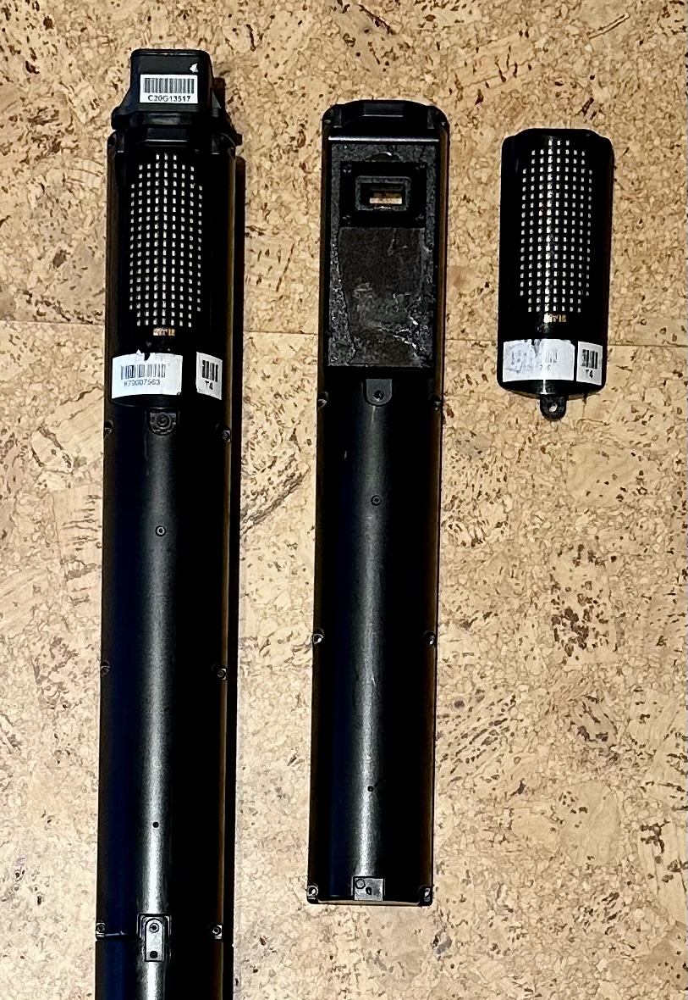
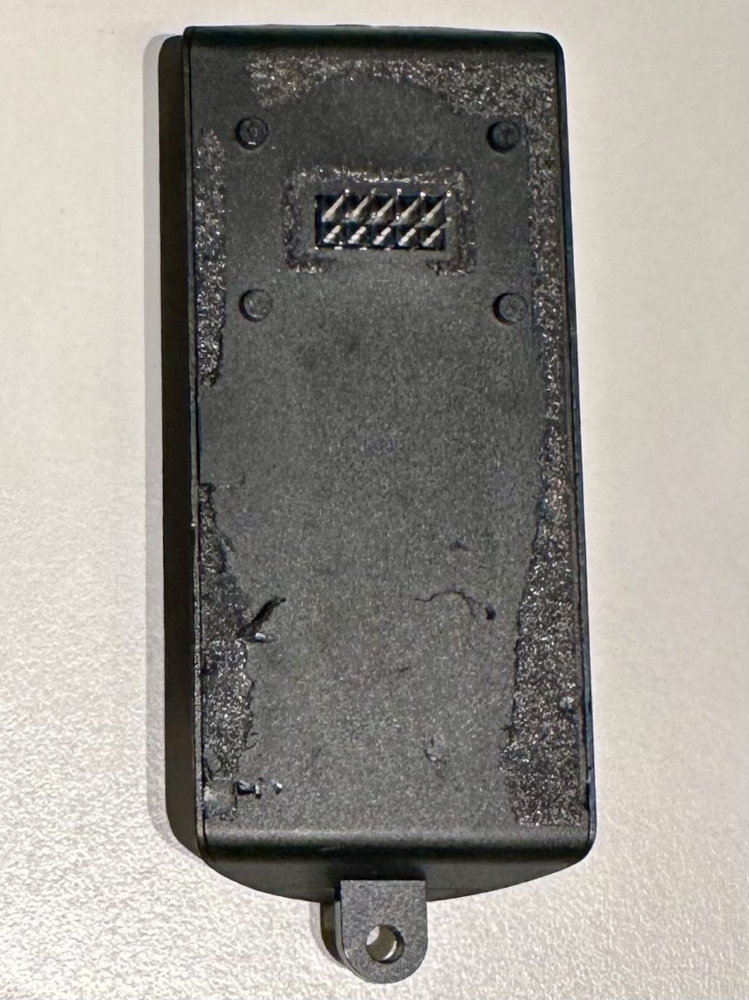
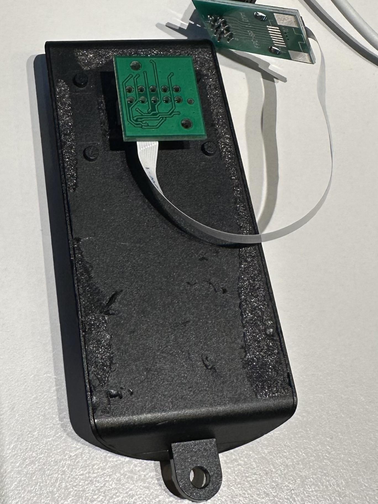
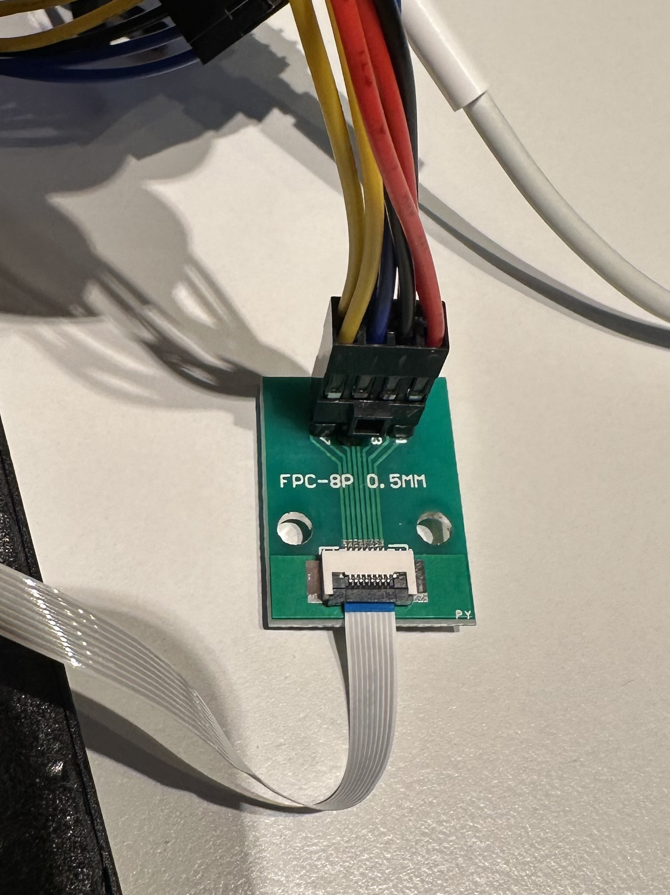
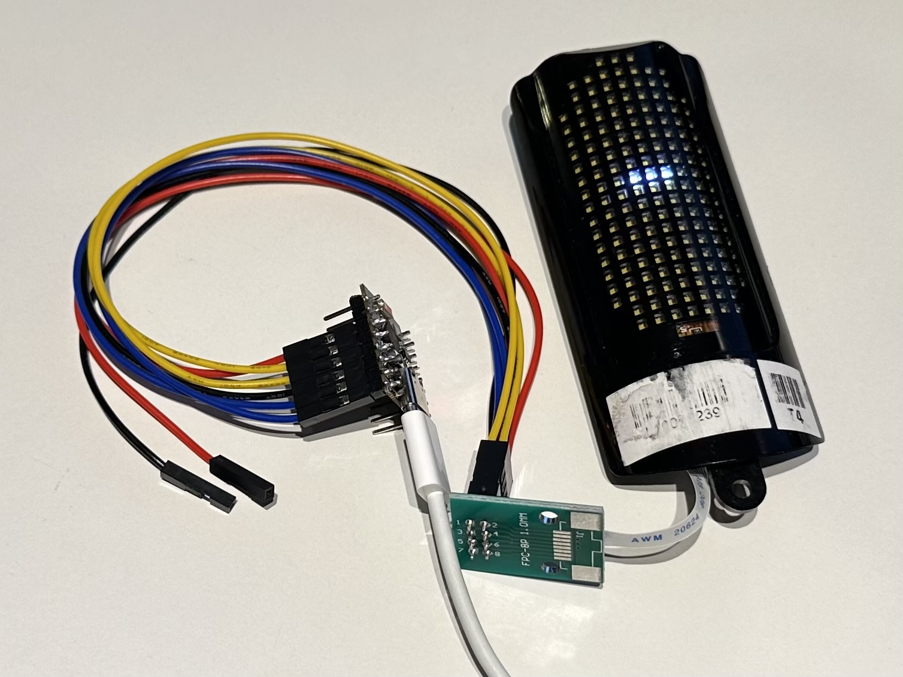

# Inside the VanMoof SX3 Display: How It Works and How to Drive It Yourself


*A salvaged SX3 panel lit up on the bench, driven over its exposed connector — no bike required.*

The little LED panel on the top tube of a VanMoof S3/X3 is a self-contained
20×9 dot-matrix display. It shows speed, battery state, lock status and a
handful of other status readouts and animations. It is also a genuinely nice
piece of hardware to repurpose: a bright, sturdy, two-controller LED matrix
with a simple I²C interface. Once you understand how it is wired and how its
image format works, you can drive it from any microcontroller and put
whatever you like on it.

This guide covers the whole stack from the ground up: the physical LED
layout, the connector and how to wire it up, the two controllers and how to
initialise them, the framebuffer and how bytes map to pixels, the
image/animation container format, and the two different ways content ends up
on screen (full-frame images versus overlays drawn straight into the
framebuffer). At the end there is a complete, self-contained sketch that
plays a looping animation, plus notes on a browser-editor-to-BLE pipeline you
can build on top.

Everything here is described from the outside in — as a hardware and
protocol reference — so you can reproduce it without any special tooling.

---

## 1. The hardware

### The panel at a glance

The display is a small flexible printed-circuit board (FPC) carrying a matrix
of individually dimmable LEDs and two LED-driver ICs. It talks to its host
over a single I²C bus. There is no framebuffer RAM you push a whole image to
in one shot; instead each controller holds one byte of PWM brightness per
LED, and you update those bytes over I²C.

Logical geometry:

* **20 rows × 9 columns** of LEDs (180 positions).
* **3-bit intensity** per pixel: 8 brightness levels, 0 (off) to 7 (full).
* The panel is split down the middle into a **left half (columns 0–4)** and
  a **right half (columns 5–8)**, each driven by its own controller.

### It is not a perfect rectangle

The corners are visually rounded — several LEDs simply are not populated. If
you render a full rectangle you will "lose" pixels in the corners, so it is
worth knowing exactly which positions exist:

```
         C0  C1  C2  C3  C4 | C5  C6  C7  C8
   R0     ·   ·   ·   #   # |  #   ·   ·   ·
   R1     ·   #   #   #   # |  #   #   #   ·
   R2     ·   #   #   #   # |  #   #   #   ·
   R3     #   #   #   #   # |  #   #   #   #
   R4     #   #   #   #   # |  #   #   #   #
    :          (rows 3–17 fully populated)
   R17    #   #   #   #   # |  #   #   #   #
   R18    ·   #   #   #   # |  #   #   #   ·
   R19    ·   #   #   #   # |  #   #   #   ·
         └──── left half ────┘└──── right half ────┘
              controller A         controller B

   #  = LED present      · = no LED at this position
```

The missing positions:

* **Row 0**: only C3, C4, C5 exist — a narrow three-wide notch at the top.
  The centre LED of that notch is the one that lights as the familiar
  "Bluetooth connected" dot.
* **Rows 1, 2, 18, 19**: the outermost columns C0 and C8 are missing.
* **Rows 3–17**: all nine columns present.

Draw into the missing cells and nothing happens — no harm done, the byte
just addresses a LED that isn't there. But if you want clean edges, treat
those positions as unavailable.

### The two controllers

Each half is driven by a **Lumissil Microsystems IS31FL3742A** — a 30×6
(up to 180-LED) I²C matrix driver in a QFN-48 package. Its register protocol
is the giveaway: a command register at `0xFE` that is unlocked by writing the
magic value `0xC5`, and a page-select register at `0xFD`. The device is
organised into *pages* — one holds the per-LED PWM brightness bytes, one
holds per-LED current scaling, and one holds global configuration.

The two controllers sit at different I²C addresses:

| Half  | Columns | I²C address |
|-------|---------|-------------|
| Left  | 0–4     | `0x30`      |
| Right | 5–8     | `0x33`      |

The chip itself drives up to 30 rows × 6 columns; this panel populates 20 of
the 30 rows and, per controller, 5 of the 6 columns. That is exactly why the
framebuffer (section 3) is organised as 30-byte column blocks with only rows
0–19 in use. In total each controller uses **150 PWM registers** (offsets
`0x00`–`0x95`), one brightness byte per LED — your framebuffer for that half.
How those 150 bytes map to the physical (row, column) positions is the single
most important detail for driving the panel, and it is covered in section 3.

### Brightness: 3 bits in, 8 bits out

The image format (section 4) specifies each pixel with a 3-bit intensity —
eight levels, 0 (off) to 7 (full) — while the controller's PWM registers are
8-bit (0–255). You choose the mapping between them. A curve that looks even
to the eye — because perceived brightness is roughly logarithmic — is a rough
doubling per step:

```
intensity :  0     1     2     3     4     5     6     7
PWM byte  : 0x00  0x04  0x08  0x10  0x20  0x40  0x80  0xFF
```

This is a good default. Nothing forces it on you; if you want a linear ramp
or a gamma curve, change the lookup table.

---

## 2. The connector and how to wire it up

### Getting the panel off the bike

The display unit lifts off the smart cartridge after removing a single screw
and easing it away from the adhesive foam that holds it down. On the back of
the housing sits the panel's own connector.



*Salvaged SX3 display modules — the dot-matrix window and mounting tab are the same across the housing sizes you'll run into.*



*The back of the module: a 2×5, 2.54 mm pin header recessed in the housing, with the mounting tab at the bottom.*

### The 2×5 header on the back

Turn the module over and you find a **2×5 (ten-pin) header on a 2.54 mm
(0.1 inch) pitch** — the everyday kind you would push jumper wires or a
ribbon-cable socket onto. With the mounting tab at the bottom, the pins are
numbered like this (odd row on top, even row below, counting right to left):

```
   ┌────┬────┬────┬────┬────┐
   │  9 │  7 │  5 │  3 │  1 │
   ├────┼────┼────┼────┼────┤
   │ 10 │  8 │  6 │  4 │  2 │
   └────┴────┴────┴────┴────┘
        (screw hole at the bottom)
```

| Pin | Signal   | Purpose                                                        |
|-----|----------|----------------------------------------------------------------|
| 1   | I²C SDA  | I²C data — LED controllers and the ambient-light sensor        |
| 2   | I²C SCL  | I²C clock — LED controllers and the ambient-light sensor       |
| 3   | +5 V     | LED supply                                                     |
| 4   | +5 V     | LED supply                                                     |
| 5   | GND      | Ground                                                         |
| 6   | GND      | Ground                                                         |
| 7   | INTB     | Interrupt from the LED controllers (open/short LED fault)      |
| 8   | +3.3 V   | Supply for the LED controllers and the light sensor            |
| 9   | SDB      | Hardware enable — brings the LED controllers out of shutdown   |
| 10  | 5Vsw     | Not used (Voltage feedback for the smart cartridge's STM32; no effect standalone) |

You can drive the panel straight from these pins — from an ESP32, for
example — and be done. But the module ships with a bit more in front of them,
which is worth knowing about.

### The daughterboard and the FFC



*The protective daughterboard seated on the 2×5 header, breaking the ten pins out to an 8-conductor FFC that normally runs to the cartridge PCB.*

In the bike, a small **daughterboard** sits on that 2×5 header and adapts it
to an **8-conductor FFC** (flat flexible cable) that runs on to the smart
cartridge's mainboard. The daughterboard is not just a passive adapter: it
carries a **TVS diode array (Würth Elektronik 824013)** that protects the
four signal lines to the controllers — I²C SDA, I²C SCL, INTB and SDB — and
adds decoupling capacitors on the supply rails.

I would treat this FFC as the panel's "official" interface, since it is the
one the module is designed around. Viewed on the side with the exposed silver
contacts (not the blue plastic stiffener), with the cable end pointing down,
the eight contacts number left to right:

```
   FFC end — silver-contact side facing you, cable end pointing down:

     ═══════════════════════════════════      flexible cable
     ┃  ▉  ▉  ▉  ▉  ▉  ▉  ▉  ▉  ┃     8 exposed contacts
     ┗━━┯━━━┯━━━┯━━━┯━━━┯━━━┯━━━┯━━━┯━━┛
        1   2   3   4   5   6   7   8       contact number
```

| FFC pin | Signal  |
|---------|---------|
| 1       | I²C SDA |
| 2       | I²C SCL |
| 3       | +5 V    |
| 4       | GND     |
| 5       | INTB    |
| 6       | +3.3 V  |
| 7       | SDB     |
| 8       | 5Vsw    |

The I²C pull-up resistors live on the flex PCB already, so you do not need
external ones.

### Wiring it to an ESP32

You have two clean options: design a small board with an FFC connector, or
grab an off-the-shelf breakout. I used the latter — an **"FPC-8P 0.5 mm"**
adapter that lands the eight FFC conductors on a 2×4, 2.54 mm header you can
jumper straight to a microcontroller.



*The FPC-8P 0.5 mm breakout: the display's FFC goes into the white ZIF connector, jumper wires come off the 2×4 header on the other side.*

One caution with these cheap breakouts: **the pad numbering silk-screened on
the top does not necessarily match the numbering on the bottom** — the two
sides can count in opposite directions. Always follow the actual copper
traces from the FFC contact to the header pin rather than trusting a printed
number. On my board the numbering on the *bottom* was the correct one, not
the top side with the pin header.

For the example sketch later in this guide (section 6) I wired it to an
ESP32-C3 like this:

```
   ┌───────────┐   8-way FFC    ┌───────────────┐   2×4 header   ┌───────────┐
   │  display  │══════════════▶│  FPC-8P 0.5mm  │──────────────▶│  ESP32-C3 │
   │  (flex)   │                │    adapter    │   jumpers      │           │
   └───────────┘                └───────────────┘                └───────────┘
```

| FFC pin | Signal   | ESP32-C3   |
|---------|----------|------------|
| 1       | I²C SDA  | GPIO4      |
| 2       | I²C SCL  | GPIO3      |
| 3       | +5 V     | 5V         |
| 4       | GND      | GND        |
| 5       | INTB     | (not used) |
| 6       | +3.3 V   | 3V3        |
| 7       | SDB      | GPIO2      |
| 8       | 5Vsw     | (not used) |

The panel needs both rails: +5 V for the LEDs and +3.3 V for the controllers
and light sensor. INTB is optional — leave it unconnected unless you want to
react to LED-fault interrupts.

**Power budget.** At high Global Current with a lot of LEDs lit at once, the
panel can pull enough current to sag a USB-powered 5 V rail — the usual
symptom is the ESP32 randomly resetting rather than anything wrong on the
I²C bus. A supply rated 5 V / >=1 A is enough headroom for full brightness.
If both the ESP32 and the display are drawing from the same USB port
(laptop port, cheap hub), give the display its own 5 V supply instead and
just share ground with the ESP32.

---

## 3. Driving the display

### Bus and reset

The panel is a standard I²C peripheral. Bring it up like this:

* **I²C at 400 kHz.** Both controllers share the bus; they are addressed
  separately (`0x30` / `0x33`).
* **A shutdown/enable line (SDB)** resets the controllers. Pulse it low then
  high before initialising, to guarantee a known state.

On an ESP32-class board a typical wiring is SDA, SCL and one GPIO for SDB.
Pick pins to suit your board; the code below uses SDA=4, SCL=3, SDB=2, to
match the wiring in section 2.

### Initialising a controller

Bringing a controller to life is: unlock, configure, clear the PWM page,
enable output. Written out as raw register writes (this is the sequence that
works on the panel, per controller):

```c
// unlock the command register (0xFE = 0xC5) and select the config page
w(addr, 0xFE, 0xC5);  w(addr, 0xFD, 0x04);
w(addr, 0x00, 0x41);  w(addr, 0x01, 0x80);   // enable + global current

// select the scaling/enable page and turn every LED "on" at full scale
w(addr, 0xFE, 0xC5);  w(addr, 0xFD, 0x02);
uint8_t on[150];  memset(on, 0xFF, sizeof(on));
writeRegBlock(addr, 0x00, on, 150);

// select the PWM page; from now on, frame writes go here as brightness bytes
w(addr, 0xFE, 0xC5);  w(addr, 0xFD, 0x00);
```

`w()` is a single register write; `writeRegBlock()` writes a run of
consecutive registers starting at an offset (see below). After this, the
active page is the PWM page, so pushing a frame is just writing 150
brightness bytes to registers `0x00`–`0x95`.

### Writing many registers at once

I²C hosts have a limited transmit buffer, so write the 150-byte PWM block in
chunks rather than one giant transaction. A safe chunk size is 24 data bytes
per transaction:

```c
void writeRegBlock(uint8_t addr, uint8_t startReg, const uint8_t* d, int len) {
  const int CHUNK = 24;
  int i = 0;
  while (i < len) {
    int n = (len - i < CHUNK) ? (len - i) : CHUNK;
    Wire.beginTransmission(addr);
    Wire.write(startReg + i);          // auto-incrementing register pointer
    for (int k = 0; k < n; k++) Wire.write(d[i + k]);
    Wire.endTransmission();
    i += n;
  }
}
```

Pushing a full frame is then just two block writes:

```c
void displayPush() {
  writeRegBlock(0x30, 0x00, fbLeft,  150);   // left half
  writeRegBlock(0x33, 0x00, fbRight, 150);   // right half
}
```

### The two framebuffers and how bytes map to pixels

You keep two 150-byte buffers in RAM, one per controller:

```c
uint8_t fbLeft[150];    // columns 0..4  → I²C 0x30
uint8_t fbRight[150];   // columns 5..8  → I²C 0x33
```

Within each buffer the LEDs are addressed **column-major**: each column
occupies a block of 30 consecutive bytes, and the row is the index inside
that block. Only rows 0–19 of each 30-byte block correspond to a physical
LED; indices 20–29 are dead space. The column blocks are laid out in
*reverse* order, which falls out of the panel's internal routing:

```
offset(left,  col, row) = (4 - col) * 30 + row      for col 0..4
offset(right, col, row) = (9 - col) * 30 + row      for col 5..8
```

Mapped out, the 150 bytes of each buffer look like this:

```
  LEFT buffer  (fbLeft, 0x30)              RIGHT buffer (fbRight, 0x33)
  ┌────────────┬────────┬───────────┐      ┌────────────┬────────┬───────────┐
  │  bytes     │ column │ rows used │      │  bytes     │ column │ rows used │
  ├────────────┼────────┼───────────┤      ├────────────┼────────┼───────────┤
  │   0 ..  29 │  col 4 │   0 .. 19 │      │   0 ..  29 │   —    │  (unused) │
  │  30 ..  59 │  col 3 │   0 .. 19 │      │  30 ..  59 │  col 8 │   0 .. 19 │
  │  60 ..  89 │  col 2 │   0 .. 19 │      │  60 ..  89 │  col 7 │   0 .. 19 │
  │  90 .. 119 │  col 1 │   0 .. 19 │      │  90 .. 119 │  col 6 │   0 .. 19 │
  │ 120 .. 149 │  col 0 │   0 .. 19 │      │ 120 .. 149 │  col 5 │   0 .. 19 │
  └────────────┴────────┴───────────┘      └────────────┴────────┴───────────┘
   within each 30-byte block: byte k = row k   (rows 20..29 = no LED)
```

Two things to notice. First, the right buffer's first 30 bytes are never
used — there is no column that maps there — so they stay zero. Second, even
within the "rows 0–19" range, the rounded-corner positions from section 1
have no LED, so writing them is a no-op.

### Every byte, and the fill order

The table above tells you where each column lives; this grid shows *every one
of the 300 bytes* as a box. The columns run in the order you actually see on
the panel — C0 on the left through C8 on the right, with the phantom column
tacked on at the far right — so the display's shape reads straight off the
`#` marks (note the three-wide notch at the top of row 0).

```
        LEFT buffer 0x30 (cols 0–4)  ┃  RIGHT buffer 0x33 (cols 5–8, +ghost)
col:  │C0 │C1 │C2 │C3 │C4 ┃C5 │C6 │C7 │C8 │·· │
blk:  │ 5 │ 4 │ 3 │ 2 │ 1 ┃10 │ 9 │ 8 │ 7 │ 6 │
byte: │120│90 │60 │30 │ 0 ┃120│90 │60 │30 │ 0 │
      ┌───┬───┬───┬───┬───┳───┬───┬───┬───┬───┐
r0    │ x │ x │ x │ # │ # ┃ # │ x │ x │ x │ . │
r1    │ x │ # │ # │ # │ # ┃ # │ # │ # │ x │ . │
r2    │ x │ # │ # │ # │ # ┃ # │ # │ # │ x │ . │
r3    │ # │ # │ # │ # │ # ┃ # │ # │ # │ # │ . │
r4    │ # │ # │ # │ # │ # ┃ # │ # │ # │ # │ . │
r5    │ # │ # │ # │ # │ # ┃ # │ # │ # │ # │ . │
r6    │ # │ # │ # │ # │ # ┃ # │ # │ # │ # │ . │
r7    │ # │ # │ # │ # │ # ┃ # │ # │ # │ # │ . │
r8    │ # │ # │ # │ # │ # ┃ # │ # │ # │ # │ . │
r9    │ # │ # │ # │ # │ # ┃ # │ # │ # │ # │ . │
r10   │ # │ # │ # │ # │ # ┃ # │ # │ # │ # │ . │
r11   │ # │ # │ # │ # │ # ┃ # │ # │ # │ # │ . │
r12   │ # │ # │ # │ # │ # ┃ # │ # │ # │ # │ . │
r13   │ # │ # │ # │ # │ # ┃ # │ # │ # │ # │ . │
r14   │ # │ # │ # │ # │ # ┃ # │ # │ # │ # │ . │
r15   │ # │ # │ # │ # │ # ┃ # │ # │ # │ # │ . │
r16   │ # │ # │ # │ # │ # ┃ # │ # │ # │ # │ . │
r17   │ # │ # │ # │ # │ # ┃ # │ # │ # │ # │ . │
r18   │ x │ # │ # │ # │ # ┃ # │ # │ # │ x │ . │
r19   │ x │ # │ # │ # │ # ┃ # │ # │ # │ x │ . │
r20   │ . │ . │ . │ . │ . ┃ . │ . │ . │ . │ . │
r21   │ . │ . │ . │ . │ . ┃ . │ . │ . │ . │ . │
r22   │ . │ . │ . │ . │ . ┃ . │ . │ . │ . │ . │
r23   │ . │ . │ . │ . │ . ┃ . │ . │ . │ . │ . │
r24   │ . │ . │ . │ . │ . ┃ . │ . │ . │ . │ . │
r25   │ . │ . │ . │ . │ . ┃ . │ . │ . │ . │ . │
r26   │ . │ . │ . │ . │ . ┃ . │ . │ . │ . │ . │
r27   │ . │ . │ . │ . │ . ┃ . │ . │ . │ . │ . │
r28   │ . │ . │ . │ . │ . ┃ . │ . │ . │ . │ . │
r29   │ . │ . │ . │ . │ . ┃ . │ . │ . │ . │ . │
      └───┴───┴───┴───┴───┻───┴───┴───┴───┴───┘
```

Legend:

* `#` — a real LED you can light (166 of them).
* `x` — a position *inside* the 20×9 grid with no LED behind it: the rounded
  corners (14). Addressable, but writing it is invisible.
* `.` — a byte *outside* the 20×9 grid: the dead rows 20–29 at the foot of
  every block, plus the whole phantom column (right-buffer bytes 0–29,
  "column 9") that maps to no LED (120 together).

The **fill order** — the order the bytes leave `writeRegBlock`, offset 0 → 149
in each buffer — is the two header rows. `blk` is the 30-byte block number,
1 → 10, and `byte` is that block's starting offset. Follow the block numbers
and you read off the fill sequence **C4, C3, C2, C1, C0** (left buffer), then
**(phantom), C8, C7, C6, C5** (right buffer). The consequence is visible in
the `byte` row: within each half the offset runs *right to left* — C0 is the
*last* block of the left buffer (bytes 120–149), C4 the first (bytes 0–29).
That reversal is exactly why `ledSet` computes `(4 - col) * 30 + row` and not
`col * 30 + row`. In total only 166 of the 300 bytes drive a visible LED; the
rest are corners with no LED, or dead space you can leave at zero.

A single helper hides all of this. Give it a logical (row, col) and a PWM
value and it writes the right byte in the right buffer:

```c
void ledSet(int row, int col, uint8_t pwm) {
  if (row < 0 || row >= 20 || col < 0 || col >= 9) return;
  if (col < 5) {
    int off = (4 - col) * 30 + row;      // left half
    if (off >= 0 && off < 150) fbLeft[off]  = pwm;
  } else {
    int off = (9 - col) * 30 + row;      // right half
    if (off >= 0 && off < 150) fbRight[off] = pwm;
  }
}
```

With `ledSet`, `clearFB` (zero both buffers) and `displayPush`, you have a
complete, addressable 20×9 display. Everything else is just deciding which
pixels to light.

---

## 4. The image and animation format

Beyond setting individual pixels, the panel is fed structured **images** —
compact binary blobs that describe one or more frames of a region of the
display. This is the format the bike's own content uses, and it is worth
adopting because it is simple, self-describing enough to render, and it is
what a browser editor or a BLE stream can hand you directly.

### Container layout

Everything is **32-bit little-endian words**. The layout is:

```
word 0        start_row          top row of the drawn region (0..19)
word 1        graphic_rows       height of the region in rows
word 2        num_frames         number of animation frames

word 3        duration[0]        frame 0 hold time, milliseconds
  :             :
word 2+nf     duration[nf-1]     frame nf-1 hold time

then, per relative row r (0 .. graphic_rows-1):
  num_frames pixel words, one per frame
```

The pixel word for relative row `r` and frame `f` lives at word index:

```
index(r, f) = num_frames * r + f + num_frames + 3
```

So the header is 3 words, then `num_frames` duration words, then the pixel
block laid out row-by-row with all of a row's frames grouped together.

### The pixel word: nine columns in one 32-bit value

Each pixel word packs the nine columns of one row, 3 bits each, MSB-first
starting at bit 24:

```
 bit 31      27  26  24 23  21 20  18 17  15 14  12 11   9 8    6 5    3 2    0
     └ unused ┘  └ C0 ┘ └ C1 ┘ └ C2 ┘ └ C3 ┘ └ C4 ┘ └ C5 ┘ └ C6 ┘ └ C7 ┘ └ C8 ┘

     intensity(col) = (word >> (24 - 3*col)) & 0x7        // 0..7
```

Column 0 is the most significant field (bits 24–26); column 8 is the least
significant (bits 0–2). Bits 27–31 are unused.

Worked example — a whole row at full brightness, all nine columns = 7:

```
 fields:   111 111 111 111 111 111 111 111 111   (cols 0..8, each = 7)
 value  :  0x07FF FFFF
 bytes  :  FF FF FF 07     (little-endian: LSB first)
```

That last line is the one to remember: a row of `FF FF FF 07` is "all nine
columns, full brightness."

### Rendering a frame

To draw frame `f`:

```c
for (r = 0; r < graphic_rows; r++) {
  word   = pixels[ num_frames*r + f + num_frames + 3 ];
  absRow = start_row + r;
  for (c = 0; c < 9; c++) {
    intensity = (word >> (24 - 3*c)) & 0x7;
    ledSet(absRow, c, LUT[intensity]);
  }
}
displayPush();
```

To animate, walk `f` from 0 to `num_frames-1`, holding each frame for its
`duration[f]` milliseconds, then loop. A single still image is just
`num_frames = 1`.

### Two ways content reaches the screen

There are two distinct rendering strategies, and understanding the
difference explains a lot about how the panel is used in practice.

**Full-frame images.** The common case: a container like the one above
describes a rectangular band (`start_row` … `start_row + graphic_rows`) and
the renderer *clears that band and draws every pixel of it* from the data.
Speed numbers, text, whole-screen animations, and the battery *outline* are
all full-frame images. The bitmap is the single source of truth for that
region; nothing is computed at draw time.

**Overlays drawn straight into the framebuffer.** Sometimes the content is
computed in code and written directly onto the framebuffer *on top of*
whatever is already there, without a container. The battery gauge is the
textbook example. It is composed in two layers:

1. A full-frame image draws the **battery outline** ("the frame").
2. A small routine then lights a number of **fill dots** inside the outline,
   based on the current state of charge, by writing those pixels directly.

The fill region is a **7-columns-wide by 3-rows-tall grid of interior
cells** (21 cells total). The state of charge is mapped to how many of those
21 cells are lit:

```
dots = floor( 21 * (clamp(soc, 7, 92) - 7) / 85 )      // 0 .. 21
```

The cells fill **column by column**, three rows per column, left to right; a
partially-filled column fills from the bottom up. So a half-charged battery
lights roughly the left half of the interior, and the level reads like a
bar. The outline image itself can be swapped for a brighter variant (for
example while charging from a power bank) — same geometry, different frame
brightness.

The takeaway: a *full-frame image* is a data-driven bitmap you render as-is,
while an *overlay* is code-driven pixels composed on top. You can mix them
freely in your own projects — draw a static background image, then poke
live values (a battery bar, a clock tick, a signal meter) straight into the
framebuffer with `ledSet` before you `displayPush`.

### Numbers, as a concrete full-frame example

The two-digit number display is a nice illustration of a full-frame image
that uses a compact font. Digits are drawn **side by side, upright**: the
tens digit occupies columns 0–3 (left half), the ones digit occupies columns
5–8 (right half), and column 4 is left as a gap. Each digit is a narrow
4-bit-wide bitmap (one nibble per row, most-significant bit = leftmost
column). A single-digit value uses only the right half unless you choose to
centre it. Because rows 0, 1, 2, 18 and 19 have missing corners, numbers are
positioned a couple of rows in from the top so no strokes land on absent
LEDs.

### Making your own images

You do not need the browser editor to produce a valid container — the
format is simple enough that a short Python script does it too. Feed it a
list of 20x9 frames (each cell an intensity 0-7) and a duration per frame in
milliseconds, and it prints a ready-to-paste PROGMEM array:

```python
#!/usr/bin/env python3
"""Pack 20x9 intensity frames into the SX3 container format."""
import struct

def pack_row(intensities):          # 9 ints 0..7, col 0 first
    v = 0
    for col, i in enumerate(intensities):
        v |= (i & 0x7) << (24 - 3 * col)
    return v

def build_image(frames, durations_ms, start_row=0, graphic_rows=20):
    assert len(frames) == len(durations_ms)
    num_frames = len(frames)
    out = bytearray()
    out += struct.pack('<III', start_row, graphic_rows, num_frames)
    for d in durations_ms:
        out += struct.pack('<I', d)
    for f in frames:
        for r in range(start_row, start_row + graphic_rows):
            out += struct.pack('<I', pack_row(f[r]))
    return bytes(out)

def to_c_array(name, data):
    lines = [f"const uint8_t {name}[] PROGMEM = {{"]
    for i in range(0, len(data), 16):
        chunk = data[i:i + 16]
        lines.append("  " + ", ".join(f"0x{b:02X}" for b in chunk) + ",")
    lines.append("};")
    return "\n".join(lines)

# Example: a diagonal at intensity 5, held for one second
frame = [[0] * 9 for _ in range(20)]
for i in range(min(20, 9)):
    frame[i][i] = 5
print(to_c_array("MY_IMAGE", build_image([frame], [1000])))
```

Paste the printed array into your sketch and hand it to the renderer from
this section like any other image.

---

## 5. What you can build with it

Once you can address the panel and render the image format, the display
becomes a general-purpose output device. A pipeline that works well and is
fun to use:

**A browser editor that exports the container format.** A small HTML/JS app
with a 20×9 grid (respecting the missing corners), an intensity picker, a
frame timeline for animations, and generators for text, numbers and battery
gauges. "Export" produces exactly the little-endian container described in
section 4. Because the format is trivial, the editor is the only place you
need floating-point-free bit-packing logic.

**A microcontroller receiver.** An ESP32 (or similar) drives a salvaged
panel and receives images/animations over BLE. A minimal transfer protocol
on top of a Nordic-UART-style service is enough:

* a **START** packet announcing the total byte length and a CRC-16,
* a series of **DATA** chunks (sequence-numbered, ~180 bytes of payload each
  so they fit inside one BLE MTU),
* an **END** marker that triggers CRC verification, header sanity checks and
  playback,
* short **ACK / error** notifications back to the sender so the browser can
  show progress and report problems (too big, CRC mismatch, truncated,
  bad header).

Put those two together and you have a wireless, in-browser design tool for a
physical LED panel: draw an animation, hit "send," watch it appear on the
display a moment later. The same receiver can equally be fed from a script,
a home-automation hub, or a button on the device itself.

Other directions the format invites: a clock or timer face, a notifier that
shows a glanceable icon per event, a VU meter or signal-strength bar (a
perfect overlay use case), or a tiny status display for another project.

---

## 6. A complete looping-animation sketch

This is the smallest useful starting point: no BLE, no dependencies beyond
`Wire`, just init both controllers and play a smooth diagonal wave forever.
It demonstrates every building block above — reset, init, the (row, col)
mapping, the intensity LUT, and `displayPush`. The pins match the wiring in
section 2; adjust them to suit your board and flash it, and the panel should
come alive immediately.

```c
#include <Arduino.h>
#include <Wire.h>
#include <math.h>

// ---- wiring (matches section 2; adjust to your board) ----
#define PIN_SDA   4
#define PIN_SCL   3
#define PIN_SDB   2          // controller shutdown/enable line
#define ADDR_LEFT   0x30
#define ADDR_RIGHT  0x33
#define ROWS  20
#define COLS   9

// 3-bit intensity (0..7) -> 8-bit PWM
const uint8_t LUT[8] = { 0x00, 0x04, 0x08, 0x10, 0x20, 0x40, 0x80, 0xFF };

uint8_t fbLeft[150];
uint8_t fbRight[150];

static uint8_t w(uint8_t a, uint8_t r, uint8_t v) {
  Wire.beginTransmission(a);
  Wire.write(r); Wire.write(v);
  return Wire.endTransmission();
}
static void writeRegBlock(uint8_t a, uint8_t startReg, const uint8_t* d, int len) {
  const int CHUNK = 24;
  for (int i = 0; i < len; ) {
    int n = (len - i < CHUNK) ? (len - i) : CHUNK;
    Wire.beginTransmission(a);
    Wire.write(startReg + i);
    for (int k = 0; k < n; k++) Wire.write(d[i + k]);
    Wire.endTransmission();
    i += n;
  }
}
static void initController(uint8_t a) {
  w(a, 0xFE, 0xC5); w(a, 0xFD, 0x04);          // unlock, config page
  w(a, 0x00, 0x41); w(a, 0x01, 0x80);          // enable + global current
  w(a, 0xFE, 0xC5); w(a, 0xFD, 0x02);          // scaling page
  uint8_t on[150]; memset(on, 0xFF, sizeof(on));
  writeRegBlock(a, 0x00, on, 150);             // all LEDs on at full scale
  w(a, 0xFE, 0xC5); w(a, 0xFD, 0x00);          // PWM page (active from now)
}
static void clearFB() {
  memset(fbLeft,  0, sizeof(fbLeft));
  memset(fbRight, 0, sizeof(fbRight));
}
static void ledSet(int row, int col, uint8_t pwm) {
  if (row < 0 || row >= ROWS || col < 0 || col >= COLS) return;
  if (col < 5) { int o = (4 - col) * 30 + row; if (o < 150) fbLeft[o]  = pwm; }
  else         { int o = (9 - col) * 30 + row; if (o < 150) fbRight[o] = pwm; }
}
static void displayPush() {
  writeRegBlock(ADDR_LEFT,  0x00, fbLeft,  150);
  writeRegBlock(ADDR_RIGHT, 0x00, fbRight, 150);
}

void setup() {
  pinMode(PIN_SDB, OUTPUT);
  digitalWrite(PIN_SDB, LOW);  delay(20);      // reset the controllers
  digitalWrite(PIN_SDB, HIGH); delay(50);

  Wire.begin(PIN_SDA, PIN_SCL, 400000);
  initController(ADDR_LEFT);
  initController(ADDR_RIGHT);
  clearFB(); displayPush();
}

void loop() {
  static uint8_t t = 0;
  clearFB();
  for (int row = 0; row < ROWS; row++) {
    for (int col = 0; col < COLS; col++) {
      // travelling diagonal wave, mapped to intensity 0..7
      float phase = (row + col) * 0.8f - t * 0.35f;
      int inten = (int)lroundf(3.5f * (1.0f + sinf(phase)));
      if (inten < 0) inten = 0;
      if (inten > 7) inten = 7;
      ledSet(row, col, LUT[inten]);
    }
  }
  displayPush();
  t++;
  delay(50);
}
```

Swap the body of `loop()` for anything you like: scroll text with a font
table, render the container format from section 4, or overlay a live value.
The scaffolding above is all the panel ever needs.



*The finished setup: FPC breakout, jumper wires and a salvaged panel lit up from a running sketch — no bike, no original mainboard.*

---

## 7. Non-blocking animation playback

The sketch above blocks in `delay(50)` between frames, which is fine for a
self-contained demo but stalls everything else in `loop()` — BLE, sensors,
buttons. To play a section-4 container image while staying responsive,
replace `delay()` with a small state machine driven by `millis()`. It reuses
the word-index formula and pixel decoding from section 4, plus `ledSet`,
`clearFB` and `displayPush` from section 6:

```c
static uint32_t imgWord(const uint8_t *img, int wordIndex) {
  const uint8_t *p = img + wordIndex * 4;
  return (uint32_t)p[0] | ((uint32_t)p[1] << 8)
       | ((uint32_t)p[2] << 16) | ((uint32_t)p[3] << 24);
}

struct AnimationPlayer {
  const uint8_t *img;
  uint32_t startRow, graphicRows, numFrames, frame;
  uint32_t frameStartedMs;
  bool active;
};
AnimationPlayer player;

void playerStart(const uint8_t *img) {
  player.img            = img;
  player.startRow        = imgWord(img, 0);
  player.graphicRows    = imgWord(img, 1);
  player.numFrames       = imgWord(img, 2);
  player.frame           = 0;
  player.frameStartedMs = 0;               // forces an immediate render
  player.active          = true;
}

void playerTick() {
  if (!player.active) return;
  uint32_t dur = imgWord(player.img, 3 + player.frame);   // duration word
  uint32_t now = millis();
  if (player.frameStartedMs == 0 || now - player.frameStartedMs >= dur) {
    clearFB();
    for (uint32_t r = 0; r < player.graphicRows; r++) {
      uint32_t wi   = player.numFrames * r + player.frame + player.numFrames + 3;
      uint32_t word = imgWord(player.img, wi);
      for (int c = 0; c < 9; c++) {
        uint8_t inten = (word >> (24 - 3 * c)) & 0x7;
        ledSet(player.startRow + r, c, LUT[inten]);
      }
    }
    displayPush();
    player.frameStartedMs = now;
    if (++player.frame >= player.numFrames) player.active = false;
  }
}

void loop() {
  playerTick();
  // ... BLE, sensors, buttons, whatever else needs to run ...
}
```

Start an animation with `playerStart(SOME_IMAGE)`; `loop()` stays
responsive for the rest of your sketch while it plays.

---

## 8. Quick reference

**Geometry**

* 20 rows × 9 columns, intensity 0–7.
* Left controller `0x30` = columns 0–4; right controller `0x33` = columns 5–8.
* Missing LEDs: row 0 has only C3–C5; rows 1, 2, 18, 19 lack C0 and C8.

**Connector (2×5 header / 8-conductor FFC)**

* Signals: I²C SDA, I²C SCL, +5 V (LEDs), +3.3 V (controllers), GND, INTB
  (fault interrupt), SDB (enable).
* I²C pull-ups are on the flex PCB; none needed externally.
* Example ESP32-C3 wiring: SDA→GPIO4, SCL→GPIO3, SDB→GPIO2, plus 5 V, 3.3 V, GND.

**Framebuffer**

* 150 bytes per controller, one PWM byte per LED.
* `offset_left  = (4 - col) * 30 + row` (col 0–4).
* `offset_right = (9 - col) * 30 + row` (col 5–8).
* Only rows 0–19 of each 30-byte column block are physical; 20–29 are dead.
* Right buffer bytes 0–29 are unused.

**Init (per controller)**

* Unlock command register: write `0xC5` to `0xFE`.
* Select page via `0xFD`: config (`0x04`), scaling (`0x02`), PWM (`0x00`).
* Set scaling page to all `0xFF`; leave PWM page active for frame writes.

**Image container (32-bit LE words)**

* `[start_row][graphic_rows][num_frames]`, then `num_frames` durations (ms),
  then pixel words.
* Pixel word index: `num_frames*row + frame + num_frames + 3`.
* Column intensity: `(word >> (24 - 3*col)) & 0x7`.
* All-on row = `FF FF FF 07`.

**Two rendering modes**

* Full-frame image: clear a band, draw every pixel from the bitmap.
* Overlay: compute pixels in code, write them onto the framebuffer on top
  (e.g. battery fill dots, live meters).

That is the entire display. From here you have everything you need to light
it, animate it, and build your own tools around it.
